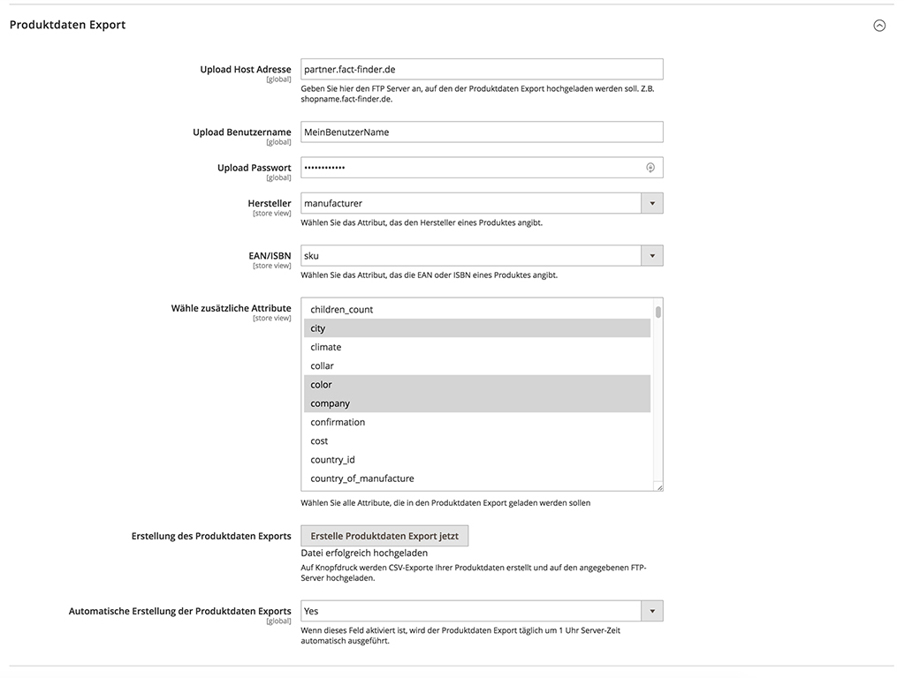

- [Einleitung](#einleitung)
- [Installation](#installation)
    - [Installation des Moduls über ein gepacktes Archiv](#installation-des-moduls-uber-ein-archiv)
    - [Aktivierung des Moduls](#aktivierung-des-moduls)
- [Backend Konfiguration](#backend-konfiguration)
    - [Allgemeine Einstellungen](#allgemeine-einstellungen)
    - [Aktivierte Web-Komponenten](#aktivierte-web-komponenten)
    - [Erweiterte Einstellungen](#erweiterte-einstellungen)
    - [Produktdaten-Export](#produktdaten-export)
- [Web-Komponenten Integration](#web-komponenten-integration)
    - [Überblick relevanter Dateien](#uberblick-relevanter-dateien)
    - [Suchbox Integration und Funktionsweise](#suchbox-integration-und-funktionsweise)
    - [Ablauf der Datenkommunikation zwischen dem Shop und FACT-Finder](#ablauf-der-datenkommunikation-zwischen-dem-shop-und-fact-finder)


# Einleitung

Diese Dokumentation hilft Ihnen dabei das FACT-Finder Web-Components SDK in Ihrem Magento 2 Shop zu integrieren und einen Überblick über die wichtigsten Funktionen zu geben. Das erste Kapitel "Installation" geht die empfohlenen Installationswege durch, das zweite Kapitel "Backend Konfiguration" beschreibt die Einstellungsmöglichkeiten im Magento 2 Backend-Bereich und das letzte Kapitel "Web-Komponenten Integration" erläutert wie die Web-Komponenten in das Shopsystem eingebunden sind und wie diese anpassbar sind.

---

# Installation

## Installation des Moduls über ein Archiv

Wenn Ihnen das FACT-Finder Modul als Archiv vorliegt, entpacken Sie dieses in das Verzeichnis app/code innerhalb Ihrer Magento 2 Installation. Die Verzeichnisstruktur muss am Ende app/code/Omikron/Factfinder sein. Nun befindet sich das Modul in ihrem Shop und kann aktiviert werden. Dazu folgen Sie dem nächsten Kapitel "Aktivierung des Moduls".


## Aktivierung des Moduls

Wechseln Sie auf Ihrem Server innerhalb der Magento 2 Installation in das Verzeichnis bin/ und führen Sie folgende Befehle nacheinander aus:

```
php -f magento setup:upgrade
php -f magento setup:di:compile
php -f magento cache:flush
```

Als letztes vergewissern Sie sich mit folgendem Befehl, dass das Modul aktiviert ist:

```
php -f magento module:status
```

Das Modul ist nun in der oberen Liste *List of enabled modules* aufgeführt. Sollte dies nicht der Fall sein, müssen Sie das Modul explizit mit folgendem Befehl aktivieren:

```
php -f magento module:enable Omikron_Factfinder
```

Danach muss wieder die obere Befehlskette ausgeführt werden:

```
php -f magento setup:upgrade
php -f magento setup:di:compile
php -f magento cache:flush
```

Prüfen Sie zusätzlich im Magento 2 Backend unter "Stores → Configuration → Advanced → Advanced" ob die Ausgabe des Moduls aktiviert ist.

---

# Backend Konfiguration

Wenn das FACT-Finder Modul aktiviert ist, finden Sie die Konfigurationsseite im Magento 2 Backend unter "Stores → Configuration → Catalog → FACT-Finder". Dort wird die Verbindung zum FACT-Finder-Service konfiguriert. Hier können einzelne Web-Komponenten aktiviert bzw. deaktiviert werden und Sie haben viele weitere Einstellungsmöglichkeiten.

## Allgemeine Einstellungen

Ganz oben auf der Konfigurationsseite befinden sich die allgemeinen Einstellungen. Hier werden die Daten eingetragen, mit denen sich der Shop mit dem FACT-Finder-Service verbindet und authentifiziert. In der ersten Zeile muss die FACT-Finder-Integration aktiviert werden. Damit Änderungen wirksam werden, ist es wichtig alle Änderungen über den Button "Save Config" zu speichern und ggf. den Cache zu leeren (*Configuration* und *Page Cache*).

Über die Schaltfläche *Test Connection* (bzw. "Teste die Verbindung") können Sie per Knopfdruck die Verbindung zum FACT-Finder Service testen, um z.B. sicher zu stellen, dass die eingegebenen Verbindungsdaten richtig sind. Beachten Sie bitte auch, dass der Channel Name für eine erfolgreiche Verbindung stimmen muss.

Am Ende der allgemeinen Einstellungen gibt es die Option *Show 'Add to Cart' Button in Search Results* (bzw. "Zeige Schaltfläche 'Zum Warenkorb hinzufügen' in Suchergebnissen"). Wenn diese Option aktiviert ist, dann wird bei den Produkten auf der Suchergebnisseite eine Schaltfläche angezeigt, mit der man das jeweilige Produkt zum Warenkorb hinzufügen kann.  
Wichtig: Die eindeutige Identifizierung eines Produktes, das in den Warenkorb hinzugefügt werden kann, erfolgt über die Variable "MasterProductNumber". Damit dieses Feature funktioniert, muss sichergestellt sein, dass beim Import der Produktdaten im FACT-Finder Backend (bei fact-finder.de) das Feld "MasterProduktNumber" importiert wird.


## Aktivierte Web-Komponenten

Hier kann eingestellt werden, welche Web-Komponenten aktiviert sind. Nur aktivierte Web-Komponenten werden im Shop angezeigt und verwendet.

 - **Suggestions** aktiviert das Laden und Anzeigen von Vorschlägen während dem Eintragen von Suchbegriffen in die Suchmaske.
 - **Filter / ASN** aktiviert die Anzeige zur Verfeinerung bzw. Eingrenzung der durchgeführten Suche.
 - **Paging** aktiviert das Durchblättern der zurückgelieferten Suchergebnisse.
 - **Sorting** aktiviert die Sortierungsfunktion für zurückgelieferte Suchergebnisse.
 - **Breadcrumb** aktiviert die Anzeige der aktuellen Position während eine Suche über die **Filter / ASN** Komponente tiefer verfeinert wird. 
 - **Products per Page** aktiviert die Anzeige für die Bestimmung der Anzahl der Suchergebnisse pro Seite.
 - **Campaigns** aktiviert das Anzeigen Ihrer bei FACT-Finder eingestellten Kampagnen, wie z.B. Advisor oder Feedback Kampagnen.
 - **Pushed Products** aktiviert das Anzeigen Ihrer eingestellten Pushed Products Kampagnen.


## Erweiterte Einstellungen

Bei den erweiterten Einstellungen sind jene zusätzlichen Parameter untergebracht, welche in der `ff-communications`-Web-Komponente verwendet werden. Jede Einstellung ist mit ihrem Standardwert vorausgefüllt und bietet einen kurzen Erklärtext.  

## Produktdaten-Export

Bei der Produktdaten-Export Konfiguration wird die Verbindung mit dem FACT-Finder-System via FTP konfiguriert. Es können die Shop-Daten generiert und nach FACT-Finder via FTP übertragen werden. Ein aktueller Stand der Produktdaten bei FACT-Finder muss gewährleistet sein, damit Komponenten wie z.B. die Suche korrekt funktionieren.

Dazu geben Sie einen FTP-Server an, auf den die CSV Datei automatisch hochgeladen wird. Die URL des FTP Servers sollte ohne voranstehendes Protokoll (ftp://) und ohne nachgestelltem Schrägstrich angegeben werden.

Die CSV Datei benutzt doppelte Anführungszeichen `"` als Feldbegrenzungszeichen (enclosure) und ein Strichpunkt `;` als Feldtrennzeichen (delimiter).

Bei der Einstellungsmöglichkeit *Manufacturer* wählen sie das Produktattribut, welches den Hersteller oder die Marke angibt - standardmäßig sollte es das Feld *manufacturer* sein.

Die Einstellungsmöglichkeit *Select additional Attributes* (bzw. "Wähle zusätzliche Attribute") bietet eine Mehrfachauswahlliste, bei der alle Attribute gewählt werden können, die in das *Zusatz-Attribute* Feld der CSV-Datei eingefügt werden.

Bevor Sie den Export mit einem Klick auf die Schaltfläche *Generate Export File(s) now* (bzw. *Erstelle Produktdaten Export jetzt*) starten, müssen - wie bei den anderen Einstellungen - die geänderten Einträge zuerst über "Save Config" gespeichert werden, damit diese aktiv sind.  

Zusätzlich haben Sie die Möglichkeit den Produktdaten-Export automatisch erstellen zu lassen. Wenn die Option *Generate Export Files(s) automatically* (bzw. *Automatische Erstellung des Produktdaten Exports*) aktiviert ist, wird der Export täglich um 01:00 Uhr Server-Zeit automatisch erstellt.

Über die folgende Datei ist es auch möglich andere Zeiten einzustellen:

```
Omikron/Factfinder/etc/crontab.xml
```

Dort können Sie den Eintrag `<schedule>0 1 * * *</schedule>` Ihren Bedürfnissen nach anpassen. Die Zeit wird mit einen Cron-Ausdruck definiert. Falls Sie mehr über Cron-Ausdrücke erfahren wollen, empfiehlt sich z.B. die [Wikipedia Seite](https://de.wikipedia.org/wiki/Cron) zu dem Thema. 




---

# Web-Komponenten Integration

Auf der Konfigurationsseite im Magento 2 Backend können die einzelnen Web-Komponenten aktiviert und deaktiviert werden.

Der HTML-Code zu den einzelnen Web-Komponenten befindet sich im Quellcode des Moduls in folgendem Ordner:

```
Omikron/Factfinder/view/frontend/templates/ff
```

Dort sind alle Web-Komponenten als Templates gespeichert und können angepasst werden. Zusätzlich können CSS-Definitionen in folgendem Ordner hinterlegt werden:

```
Omikron/Factfinder/view/frontend/web/css/ff
```

Dort gibt es zu den meisten Templates eine CSS Datei, die Sie benutzen können. Zusätzlich haben Sie noch folgende CSS Datei, in die Sie z.B übergeordnete Stylings einfügen können:
 
```
Omikron/Factfinder/view/frontend/web/css/default.css
```

Hinweis: Nachdem statische Inhalte, wie in diesem Fall CSS Styles, geändert werden, müssen
diese in die Magento 2 Umgebung neu geladen werden, damit Magento sie findet. Das geht über folgenden Befehl (auszuführen aus dem Verzeichnis bin/ ):

```
php -f magento setup:upgrade setup:static-content:deploy  
```

Die PHP-Klassen zu den Templates befinden sich im Ordner:

```
Omikron/Factfinder/Block/FF
```

Dort können Sie beispielsweise eigene Funktionen schreiben, die dann nach Bedarf im Template aufgerufen werden können.

Die Templates können Sie nach Belieben überall in ihr Shopsystem einbinden. Das geht in Magento 2 natürlich über veschiedene Wege, z.B. über diverse Layoutdefinitionen in XML, mit denen Sie das Layout Ihres Shops bearbeiten können. Die Templates können auch untereinander verschachtelt werden. Als Beispiel wurde in diesem SDK standardmäßig das `ff-suggest`-Element in das `ff-searchbox`-Template integriert. Siehe dazu:

```php
Omikron/Factfinder/view/frontend/templates/ff/searchbox.phtml:7

<?php echo $this->getLayout()
->createBlock('Omikron\Factfinder\Block\FF\Suggest')
->setTemplate('Omikron_Factfinder::ff/suggest.phtml')
->toHtml(); ?>
```

## Überblick relevanter Dateien

Die folgende Ansicht gibt einen Überblick über die Dateien und deren Orte. Diesen Dateien wird eine besondere Bedeutung beigemessen. Viele davon wurden im letzten Abschnitt erwähnt, weitere folgen in den nächsten Kapiteln.

```
.
`-- Omikron  
    `-- Factfinder  
        |-- Block  
        |   `-- FF  
        |       |-- ASN.php  
        |       |-- Breadcrumb.php  
        |       |-- Campaign.php  
        |       |-- Communication.php  
        |       |-- Paging.php  
        |       |-- ProductsPerPage.php  
        |       |-- PushedProductsCampaign.php  
        |       |-- RecordList.php  
        |       |-- Searchbox.php  
        |       |-- Sortbox.php  
        |       `-- Suggest.php
        |-- Helper  
        |   `-- ResultRefinder.php
        |-- etc
        |   `-- crontab.xml
        `-- view  
            `-- frontend  
                |-- layout  
                |   |-- default.xml  
                |   `-- factfinder_result_index.xml  
                |-- templates  
                |   `-- ff  
                |       |-- asn.phtml  
                |       |-- breadcrumb.phtml  
                |       |-- campaign.phtml  
                |       |-- communication.phtml  
                |       |-- paging.phtml  
                |       |-- products-per-page.phtml  
                |       |-- pushed-products-campaign.phtml  
                |       |-- record-list.phtml  
                |       |-- searchbox.phtml  
                |       |-- sortbox.phtml  
                |       `-- suggest.phtml  
                `-- web  
                    |-- css  
                    |   |-- ff  
                    |   |   |-- asn.css
                    |   |   |-- breadcrumb-trail.css
                    |   |   |-- paging.css
                    |   |   |-- products-per-page-dropdown.css
                    |   |   |-- record-list.css
                    |   |   |-- sortbox.css
                    |   `-- default.css 
                    `-- images 
                            `-- ... 
```


## Suchbox Integration und Funktionsweise

Sobald die FACT-Finder-Integration in der Konfiguration aktiviert ist, wird automatisch die Suchbox-Web-Komponente aktiviert und ersetzt die Standardsuche in Magento 2.

Das Template zu der FACT-Finder-Suche finden Sie unter:
```
Omikron/Factfinder/view/frontend/templates/ff/searchbox.phtml
```

Wenn Sie eine Suche ausführen, werden Sie automatisch auf eine neue, verbesserte Version der Magento 2 Suchergebnisseite weitergeleitet, die mit den FACT-Finder Daten umgehen kann. Des Weiteren wird die URL der neuen Suchergebnisseite von FACT-Finder mit relevanten Daten bereichert, wie z.B. dem verwendeten Such-Query-String oder dem FACT-Finder Channel, über den die Suche läuft. Im Quellcode des Moduls befindet sich die Layoutdefinition der Suchergebnisseite in folgender XML-Datei:
```
Omikron/Factfinder/view/frontend/layout/factfinder_result_index.xml
```

In diesem Layour sind viele der Templates schon integriert, u.a. auch `ff-record-list`, welche die Suchergebnisse anzeigt.

## Ablauf der Datenkommunikation zwischen dem Shop und FACT-Finder

Wenn eine Suchanfrage gesendet wird, geht diese nicht direkt an FACT-Finder, sondern verläuft zuerst über einen eigens dafür vorgesehenen Controller, welcher die Anfrage an das FACT-Finder-System weiterleitet, die Antwort entgegennimmt, verarbeitet, und erst danach wieder an das Frontend bzw. die Web-Komponenten zurückgibt.

Die Verarbeitung der Antwort findet in folgender PHP-Klasse statt:
```
Omikron/Factfinder/Helper/ResultRefiner.php
```

Dort können Sie in der Methode `refine($jsonString)` den von FACT-Finder zurückkommenden JSON-String anreichern bzw. weiterverarbeiten, bevor er mit `return $jsonString` zurückgegeben wird.


