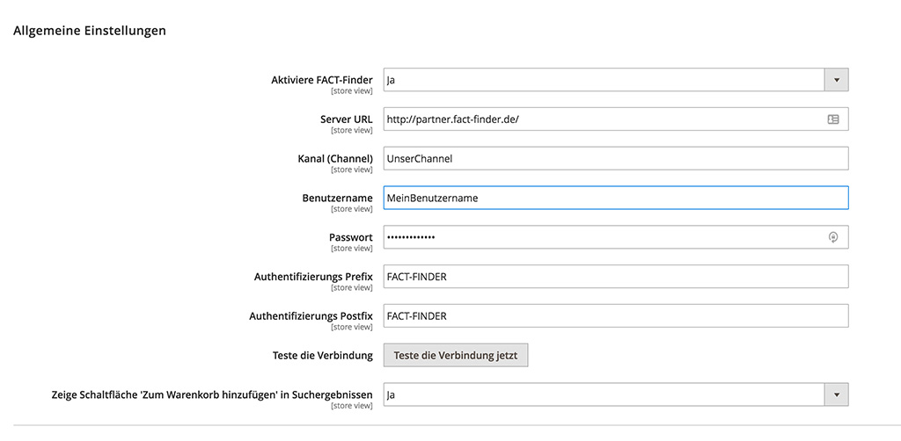

# FACT-Finder® Web Components for Magento 2

This document helps you integrate the FACT-Finder Web Components SDK into your Magento 2 Shop. In addition, it gives a
concise overview of its primary functions. The first chapter *Installation* walks you through the suggested installation
processes. The second chapter “Backend Configuration” explains the customisation options in the Magento 2 backend. The
final chapter *Web Component Integration* describes how the web components interface with the shop system and how to
customise them. 

## Requirements
This module supports:
 * Magento 2 version 2.2 and higher 
 * PHP version 7.1 and higher.
 
Warning: PHP 7.0 is not supported

## Installation

To install module, open your terminal and run the command:

    composer require omikron/magento2-factfinder

Alternatively, you may want to add module reference to `composer.json` file:

    "require": {
        "omikron/magento2-factfinder": "VERSION YOU WANT TO INSTALL"
    }

and run command:

    composer update

If, for some reason, `composer` is not available globally, proceed to install it following the instructions available
on the [project website](https://getcomposer.org/doc/00-intro.md).

## Activating the Module

From the root of your Magento 2 installation, enter these commands in sequence:

    php bin/magento module:enable Omikron_Factfinder
    php bin/magento setup:upgrade

As a final step, check the module activation by running:

    php bin/magento module:status

The module should now appear in the upper list *List of enabled modules*.

Also, check in the Magento 2 backend "Stores → Configuration → Advanced → Advanced" if the module output is activated.


## Backend Configuration

Once the FACT-Finder module is activated, you can find the configurations page under "Stores → Configuration → Catalog → FACT-Finder". Here you can customise the connection to the FACT-Finder service. You can also activate and deactivate single web components, as well as access many additional settings.

### General Settings

At the top of the configurations page are the general settings. The information with which the shop connects to and authorises itself to the FACT-Finder Service are entered here. In the first line, activate your FACT-Finder integration. Before any changes become active, save them by clicking “Save Config”. In some cases, you need to manually empty the cache (*Configuration* and *Page Cache*).

Click the button “Test Connection” to check the connection to the FACT-Finder service. Please note the channel name needs to be entered correctly to establish a connection.

At the end of the general settings section is an option *Show 'Add to Cart' Button in Search Results*. Activate this option to add a button to the products displayed on the search result page, which directly adds that product to the shopping cart.
Warning: The product added to the cart is identified by the variable "MasterProductNumber". To allow this function to work correctly, the field "MasterProductNumber" must be imported to the FACT-Finder backend (on fact-finder.de).   



### Activate Web Components

Here you can decide which web components are activated. Only active web components can be used and displayed in the shop.

 - **Suggestions** activates loading and displaying suggestions while search terms are entered into the search bar.
 - **Filter / ASN** activates the functions to narrow down and refine search results.
 - **Paging** activates paging through the returned search results.
 - **Sorting** activates a sorting function for returned search results.
 - **Breadcrumb** activates displaying the current position during a search. Can be refined with the **Filter / ASN** component. 
 - **Products per Page** activates an option to limit the number of displayed search results per page.
 - **Campaigns** displays your active FACT-Finder campaigns, e.g. advisor and feedback campaigns.
 - **Pushed Products** displays your pushed products campaigns. 

### Advanced Settings

Advanced Settings contains additional parameters used for the `ff-communication` web component. Each setting is set to a
 default value and has a short explanatory text attached.  

### Product Data Export

This option configures the connection with the FACT-Finder system via FTP. Shop data can be generated and transferred to
FACT-Finder using FTP. FACT-Finder needs to be up to date on the product data, to ensure that components like the search work as intended.

Enter an FTP-server to which the CSV file is uploaded automatically. The URL needs to be entered without the protocol
prefix (ftp://) and without the slash at the end.

The CSV file uses double quotes `"` for field enclosure and a semi-colon `;` as field delimiter.

The *Select additional Attributes* option offers a multiple-choice list of attributes. Select all of those you want added to the CSV file.

Before starting the export by clicking *Generate Export File(s) now*, you need to commit all changes by clicking “Save Config”. 
The exception from that rule is `Test Connection` function which always takes the actual values from the corresponding fields. 
 


### Updating Field Roles
Field roles are assigned while creating new channel in FACT-Finder application, however they can be changed anytime. In this situations, You need to update field roles which are being kept in Magento database for tracking purposes.
To updates field roles, use the button `Update Field Roles`

#### Http Export
Feed export is also available to trigger by visiting specific URL, which is also able to be secured by Basic Auth (username and password configured at section Http Export). You can configure Your FACT-Finder application to download the feed directly from this location.

Exports are available under following locations:
* `https://YOUR_SHOP_URL/factfinder/export/product/store/YOUR_STORE_ID` - for exporting product feed (or combined feed if You have cms export enabled and You've chosen to export product and cms data in one file)
* `https://YOUR_SHOP_URL/factfinder/export/store/store/YOUR_STORE_ID`- fore cms export

If there's no `store id` provided, feed will be generated with the default store (by default with id = 1)


### Cron configuration

You can  set the program to generate the product data export automatically. Activate the option *Generate Export Files(s) automatically* and the export is generated every day at 01:00 server time.

`<schedule>0 1 * * *</schedule>` is a default value however You can define your own cron expression in the module configuration at `Cron Schedule` section.
  


## CMS Export

You can export Your cms pages to FACT-Finder to present them in suggest results. You can specify whether You want to export cms pages content to separate channel, or using single channel, which You are using for standard products information export.
Both ways offer same functionality but in different ways and are described below.


* **Export Enabled** - determine if CMS content should be exported or not
* **Use separate channel** - determine if exported CMS content should be exported to standard channel, or to the different one.
If this option is set to "Yes", additional field "Channel" appears where You need provide the name of channel which will serve CMS suggest results.
* **Channel** - Channel name used for CMS export. This field appears only if *Use separate channel* is turned on.
* **Generate CMS Feed** - On button click all CMS data is exported and uploaded to configured FTP server
* **Pages Blacklist** - allow user to filter out pages, which should not be exported, for example "404 Not Found page" should not be visible at suggested records

Before You start exporting Your CMS content to FACT-Finder You need to prepare it for correctly serving this data to Your Magento application.

### Create new suggest type
At first You need to create a new suggest type named **cms**. I'ts because the new <ff-suggest-item> was added with type attribute equals to"cms"

    <ff-suggest-item type="cms">


It's also  required to configure the return data of newly created suggest type. It's recommended to set return data as it's shown 
on screen, however You can also choose more fields to be returned. You should add page url to returned data to allow users directly 
reaching them from suggest component. If You want to present also page images, it's also worth adding them to returned data


Please note that each field needs to be correctly bind to html tag using access path same as in the FACT-Finder JSON object. 
The example below shows how to render page url

    <a href="{{attributes.PageLink}}" data-redirect="{{attributes.PageLink}}"'

### Using Single Channel 
Using single channel is recommended way of integrate Your CMS with FACT-Finder, however it requires additional
configuration in FACT-Finder backend. In order to prevent CMS pages appears in search results
You need to mark CMS related columns as no searchable (CMS results are displayed only in suggest component).


### Using Separate channel
This solution does not require You to make any changes to channel configuration regarding columns searchability, however  You need to create a new channel.
You need also to add new suggest type in Your newly created channel, as it is described in section [New Suggest Type](#create-new-suggest-type). Also You need to
set configuration option **Activate Enrichment feature** to value **Yes** in module configuration.

Despite the fact that due to the use of separate channels, the products data will not be mixed up with CMS, and you do not need to perform any additional
operations to prevent CMS from appearing in the search results, this solution has one drawback. Two requests to FACT-Finder, will be performed in order to recieve full response: one for products and
one for CMS content. To merge them before returning to browser, module uses proxy to prepare final response from two separate FACT-Finder response. Because of that, the performance
of this solution will be lower, since all request are passed through Http server of Your Magento application.


## Web Component Integration

You can activate and deactivate any web components from the configurations page in the Magento 2 backend.

The HTML code for the web components can be found in this folder:

    Omikron/Factfinder/view/frontend/templates/ff

The module styles can be found in this folder

    Omikron/Factfinder/view/frontend/web/css/source/ff

Since Magento 2 is using Less, all source styles are written in this stylesheet language
 
    Omikron/Factfinder/view/frontend/web/css/source/_module.less

Warning: After changing static content styles, you need to restart the Magento 2 environment, for Magento to be able to find them. Use this command:

    php bin/magento setup:upgrade
    php bin/magento setup:static-content:deploy  

You can integrate the templates anywhere within your shop system. The recommended way is to use Magento2 layouts for that.
As an example, the `ff-suggest` element was integrated into the `ff-searchbox` template for this SDK: 

```xml
<referenceBlock name="top.search">
    <action method="setTemplate" ifconfig="factfinder/general/is_enabled">
        <argument name="template" xsi:type="string">Omikron_Factfinder::ff/searchbox.phtml</argument>
    </action>
    <block class="Magento\Framework\View\Element\Template" name="factfinder.suggest" as="suggest" ifconfig="factfinder/components/ff_suggest" template="Omikron_Factfinder::ff/suggest.phtml">
        <block class="Magento\Framework\View\Element\Template" ifconfig="factfinder/cms_export/ff_cms_export_enabled" name="factfinder.suggest.cms" as="suggest.cms" template="Omikron_Factfinder::ff/suggest-cms.phtml">
            <arguments>
                <argument name="view_model" xsi:type="object">Omikron\Factfinder\ViewModel\Suggest</argument>
            </arguments>
        </block>
    </block>
</referenceBlock>
```

You can also instantiate block in templates using the Magento Layout API, but it's not a recommended way

```php
<?php echo $this->getLayout()
->createBlock(\Magento\Framework\View\Element\Template::class)
->setTemplate('Omikron_Factfinder::ff/suggest.phtml')
->toHtml(); ?>
```

### Search Box Integration and Functions

As soon as the FACT-Finder-Integration is activated in the configuration, the search box web component is automatically activated. It replaces your standard search in Magenteo 2.

You can find the template for the FACT-Finder Search at:

    Omikron/Factfinder/view/frontend/templates/ff/searchbox.phtml

Once you perform a search, you will automatically be redirected to a new and improved version of the Magento 2 search result page, which works with FACT-Finder data. Additionally, FACT-Finder enriches the new search result page’s URL with relevant data, like the search’s FACT-Finder channel or the search query string. The module’s source code contains the search results’ layout definition in this XML file:

    Omikron/Factfinder/view/frontend/layout/factfinder_result_index.xml

Several templates are already integrated into this layout, among others `ff-record-list`, which displays the search results.
 
### Process of Data Transfer between Shop and FACT-Finder
By default search/suggest requests are performed directly to FACT-Finder bypassing Magento backend. However if for some reason, You want to modify request parameters
or want to modify the response before returning it to the front, You can enable **Enrichment feature**. By enabling this, once a search query is sent, it does not immediately reach FACT-Finder, but is handed off to a specific controller

    Omikron/Factfinder/Controller/Proxy/Call.php

which hands the request to the FACT-Finder system, receives the answer, processes it and only then returns it to the frontend/web component.
Once response from FACT-Finder is available, proxy controller emits an `ff_proxy_post_dispatch` event which allows user to listen in order to modify and enrich recieved data


## License
FACT-Finder® Web Components License. For more information see the [LICENSE](LICENSE) file.
