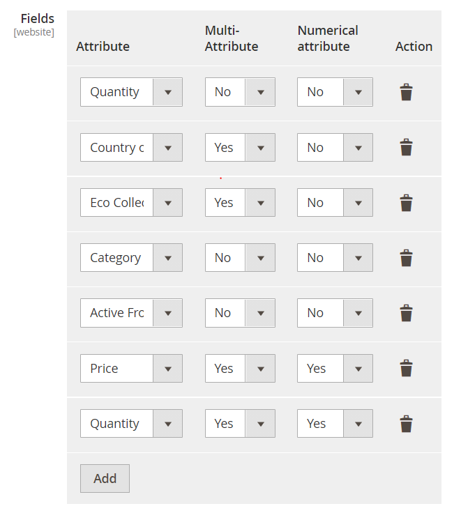

# FACT-Finder® Web Components for Magento 2

[](https://packagist.org/packages/omikron/magento2-factfinder)
[](https://github.com/FACT-Finder-Web-Components/magento2-module/graphs/contributors)
[](https://travis-ci.org/FACT-Finder-Web-Components/magento2-module)

This document helps you integrate the FACT-Finder Web Components SDK into your Magento 2 Shop. In addition, it gives a
concise overview of its primary functions. The first chapter *Installation* walks you through the suggested installation
processes. The second chapter “Backend Configuration” explains the customisation options in the Magento 2 backend. The
final chapter *Web Component Integration* describes how the web components interface with the shop system and how to
customise them. 

## Table of contents
- [Requirements](#requirements)
- [Installation](#installation)
- [Activating the Module](#activating-the-module)
- [Backend Configuration](#backend-configuration)
    - [General Settings](#general-settings)
    - [Advanced Settings](#advanced-settings)
    - [Activated Web Components](#activated-web-components)
    - [Export Settings](#export-settings)
        - [Updating Field Roles](#updating-field-roles)
        - [Automatic Import](#automatic-import)
- [Data Export](#data-export)
    - [Integration Methods](#integration-methods)
        - [FTP Export](#ftp-export)
        - [HTTP Export](#http-export)
    - [CMS Export](#cms-export)
    - [Console Command](#console-command)
- [Web Component Integration](#web-component-integration)
    - [Searchbox Integration and Functions](#searchbox-integration-and-functions)
    - [Process of Data Transfer between Shop and FACT-Finder](#process-of-data-transfer-between-shop-and-fact-finder)
        - [Using Proxy](#using-proxy)
    - [Using FACT-Finder on category pages](#using-fact-finder-on-category-pages)
- [Modification examples](#modification-examples)
    - [Changing existing column names](#changing-existing-column-names)
    - [Adding new column](#adding-new-column)
    - [Adding custom communication parameter](#adding-custom-communication-parameter)
    - [Adding custom product data provider](#adding-custom-product-data-provider)
- [Contribute](#contribute)
- [License](#license)
    
## Requirements

This module supports:

- Magento 2 version 2.2 and higher
- PHP version 7.1 and higher  
  **Warning**: PHP 7.0 is not supported

## Installation

To install module, open your terminal and run the command:

    composer require omikron/magento2-factfinder

Optionally, you can specify a version constraint, e.g. `omikron/magento2-factfinder:^1.3`. Refer to Composer manual
for more information. If, for some reason, `composer` is not available globally, proceed to install it following the
instructions available on the [project website](https://getcomposer.org/doc/00-intro.md).

## Activating the Module

From the root of your Magento 2 installation, enter these commands in sequence:

    php bin/magento module:enable Omikron_Factfinder
    php bin/magento setup:upgrade

As a final step, check the module activation by running:

    php bin/magento module:status

The module should now appear in the upper list *List of enabled modules*.

Also, check in the Magento 2 backend "Stores → Configuration → Advanced → Advanced" if the module output is activated.


## Backend Configuration

Once the FACT-Finder module is activated, you can find the configurations page under "Stores → Configuration → Catalog → FACT-Finder". Here you can customise the connection to the FACT-Finder service. You can also activate and deactivate single web components, as well as access many additional settings.

### General Settings

At the top of the configurations page are the general settings. The information with which the shop connects to and authorises itself to the FACT-Finder Service are entered here. In the first line, activate your FACT-Finder integration. Before any changes become active, save them by clicking "Save Config".
In some cases, you need to manually empty the cache (*Configuration* and *Page Cache*).
Click the button "Test Connection" to check the connection to the FACT-Finder service.

**Note:** the channel name needs to be entered correctly to establish a connection.

Here you can also enable the rendering of category pages using FACT-Finder. More details can be found [here](#using-fact-finder-on-category-pages).

At the end of the *General Settings* section is an option *Show 'Add to Cart' Button in Search Results*. Activate this option to add a button to the products displayed on the search result page, which directly
adds that product to the shopping cart. This feature works only for simple products. For configurable products user will be redirected to product page to choose specific product variant.
Warning: The product added to the cart is identified by the variable "MasterProductNumber". To allow this function to work correctly, the field "MasterProductNumber" must be imported to the FACT-Finder backend (on fact-finder.de).   

By enabling option *Activate Logging*, all exceptions thrown during communication with FACT-Finder server will be saved in log file `var/log/factfinder.log`.

**Note:** that is a server side communication option: Web Components behaviour won't be affected.


### Advanced Settings

Advanced Settings contains additional parameters used for the `ff-communication` web component. Each setting is set to a
default value and has a short explanatory text attached.  
 
#### Currency and Country Settings
You don't need to set currency nor country only for module purposes. It will use currently used currency and pass this information to `ff-communication`
component as respectively `currency-code` and `country-code` parameters. You can find these settings under Magento General settings
- [How to configure currency?](https://docs.magento.com/m2/ce/user_guide/stores/currency-configuration.html)
- [How to configure country?](https://docs.magento.com/m2/ce/user_guide/stores/country-options.html)


### Activated Web Components
Here you can decide which web components are activated. Only active web components can be used and displayed in the shop.

- **Suggestions** activates loading and displaying suggestions while search terms are entered into the search bar.
- **Filter / ASN** activates the functions to narrow down and refine search results.
- **Paging** activates paging through the returned search results.
- **Sorting** activates a sorting function for returned search results.
- **Breadcrumb** activates displaying the current position during a search. Can be refined with the **Filter / ASN** component.
- **Products per Page** activates an option to limit the number of displayed search results per page.
- **Campaigns** displays your active FACT-Finder campaigns, e.g. advisor and feedback campaigns.
- **Pushed Products** displays your pushed products campaigns.

### Export Settings
This option configures the connection with the FACT-Finder system via FTP. Shop data can be generated and transferred to
FACT-Finder using FTP. FACT-Finder needs to be up to date on the product data, to ensure that components like the search work as intended.

Enter an FTP-server to which the CSV file is uploaded automatically. The URL needs to be entered without the protocol
prefix (`ftp://`) and without the slash at the end.

The CSV file uses double quotes `"` for field enclosure and a semi-colon `;` as field delimiter.

The *Select additional Attributes* option offers a multiple-choice list of attributes. Select all of those you want added to the CSV file.

Before starting the export by clicking *Generate Export File(s) now*, you need to commit all changes by clicking "Save Config".
The exception from that rule is `Test Connection` function which always takes the actual values from the corresponding fields. 
 


#### Updating Field Roles
Field roles are assigned while creating new channel in FACT-Finder application, however they can be changed anytime. In this situations, You need to update field roles which are being kept in Magento database for tracking purposes.
To updates field roles, use the button `Update Field Roles`

#### Automatic Import
Once the feed file is uploaded (using [FTP Export](#ftp-export)), in order FACT-Finder to start serving new data, import needs to be triggered. Module allows
You to enable automatic import which makes FACT-Finder import will be triggered, right after the feed file is uploaded onto FTP server. You can also select which of data types
should be imported automatically
- Data (Search)
- Suggest
This is a multiselect field so You can select both of them

## Data Export
In following section You'll get information how, to integrate Your feed with FACT-Finder. Feed is built the same way, regardless of chosen method, so You can choose from one of possible methods.  
### Integration Methods
#### FTP export
This method exports feed from shop system and uploads it to FTP server. In order to use this method of export, You need to have FTP server configured (described in section [Export Settings](#export-settings)).
Then You can click the button (visible below) to generate and then, upload file via FTP.
 
 now")

Using of that button is dedicated mostly for ad-hoc export. In production environment You'll rather use Cron job which will do the same work without forcing You to click the export button each time You want to send new data to FACT-Finder.
To configure Cron, please activate the option *Generate Export Files(s) automatically* and the export will be generated every day at 01:00 server time.

In file [crontab.xml](src/etc/crontab.xml) You can see a expression `<schedule>0 1 * * *</schedule>` which is a default value however You can define your own cron expression in the module configuration (section visible below).
Value set here, will override the default crontab config.
Please remember that this setting is only for that specific task ran under Magento supervisor. It won't work until You have not system Cron configured. To do that, You'll need to add Magento Cron entrypoint to Your system crontab file. 
Read this [tutorial](https://devdocs.magento.com/guides/v2.3/config-guide/cli/config-cli-subcommands-cron.html) for more information
  


#### HTTP Export

Alternative way to integrate Your feed is to use builtin FACT-Finder functionality to periodically download feed from specific URL
which the feed is accessible at. This URL should be secured by Basic Auth (username and password configured at section [Export Settings](#export-settings))
in order only authenticated users get access to. By making this URL no secured, You are allowing literally everyone to download Your feed!  

Exports are available under following locations:

- `https://YOUR_SHOP_URL/factfinder/export/product/store/YOUR_STORE_ID` - for exporting product feed (or combined feed if You have cms export enabled and You've chosen to export product and cms data in one file)
- `https://YOUR_SHOP_URL/factfinder/export/cms/store/YOUR_STORE_ID`- for CMS export

If there's no `store id` provided, feed will be generated with the default store (by default with id = 1)

You should provide this URL in Your FACT-Finder UI


### CMS Export

You can export Your cms pages to FACT-Finder to present them in suggest results. You can specify whether You want to export cms pages content to separate channel, or using single channel, which You are using for standard products information export.
Both ways offer same functionality but in different ways and are described below.


- **Export Enabled** - determine if CMS content should be exported or not
- **Use separate channel** - determine if exported CMS content should be exported to standard channel, or to the
  different one. If this option is set to "Yes", additional field "Channel" appears where You need provide the name of
  channel which will serve CMS suggest results.
- **Channel** - Channel name used for CMS export. This field appears only if *Use separate channel* is turned on.
- **Generate CMS Feed** - On button click all CMS data is exported and uploaded to configured FTP server
- **Pages Blacklist** - allow user to filter out pages, which should not be exported, for example "404 Not Found page"
  should not be visible at suggested records

Before You start exporting Your CMS content to FACT-Finder You need to prepare it for correctly serving this data to Your Magento application.

#### Create new suggest type
At first You need to create a new suggest type named **cms**. I'ts because the new <ff-suggest-item> was added with type attribute equals to"cms"

    <ff-suggest-item type="cms">


It's also  required to configure the return data of newly created suggest type. It's recommended to set return data as it's shown 
on screen, however You can also choose more fields to be returned. You should add page URL to returned data to allow users directly 
reaching them from suggest component. If You want to present also page images, it's also worth adding them to returned data


**Note:**
Each field needs to be correctly bind to html tag using access path same as in the FACT-Finder JSON object. 
The example below shows how to render page URL

    <a href="{{attributes.PageLink}}" data-redirect="{{attributes.PageLink}}"'

#### Using Single Channel 
Using single channel is recommended way of integrate Your CMS with FACT-Finder, however it requires additional
configuration in FACT-Finder backend. In order to prevent CMS pages appears in search results
You need to mark CMS related columns as no searchable (CMS results are displayed only in suggest component).


#### Using Separate channel
This solution does not require You to make any changes to channel configuration regarding columns searchability, however  You need to create a new channel.
You need also to add new suggest type in Your newly created channel, as it is described in section [New Suggest Type](#create-new-suggest-type). Also You need to
set configuration option **Use Proxy** to value **Yes** in module configuration.

Despite the fact that due to the use of separate channels, the products data will not be mixed up with CMS, and you do not need to perform any additional
operations to prevent CMS from appearing in the search results, this solution has one drawback. Two requests to FACT-Finder, will be performed in order to recieve full response: one for products and
one for CMS content. To merge them before returning to browser, module uses proxy to prepare final response from two separate FACT-Finder response. Because of that, the performance
of this solution will be lower, since all request are passed through Http server of Your Magento application.


### Console Command
If You are developer and want to test feed is generated correctly or You do not want to executing magento cron
You can use console command which is implementation of Command of Symfony Console Component, builtin in Magento2. 
Command name: `factfinder:export:products`. You can add execution of this command to Your crontab file.
You can customize execution be configuring following options (which all are optional)
- store - define a store, which the product data will be taken from
- skip-ftp-upload - skips the ftp upload
- skip-push-import - skips triggering import
## Web Component Integration

You can activate and deactivate any web components from the configurations page in the Magento 2 backend.

The HTML code for the web components can be found in this folder:

    src/view/frontend/templates/ff

The module styles can be found in this folder

    src/view/frontend/web/css/source/ff

Since Magento 2 is using Less, all source styles are written in this stylesheet language
 
    src/view/frontend/web/css/source/_module.less

Warning: After changing static content styles, you need to restart the Magento 2 environment, for Magento to be able to find them. Use this command:

    php bin/magento setup:upgrade
    php bin/magento setup:static-content:deploy  

You can integrate the templates anywhere within your shop system. The recommended way is to use Magento2 layouts for that.
As an example, the `ff-suggest` element was integrated into the `ff-searchbox` template for this SDK: 

```xml
<referenceBlock name="top.search">
    <action method="setTemplate" ifconfig="factfinder/general/is_enabled">
        <argument name="template" xsi:type="string">Omikron_Factfinder::ff/searchbox.phtml</argument>
    </action>
    <block class="Magento\Framework\View\Element\Template" name="factfinder.suggest" as="suggest" ifconfig="factfinder/components/ff_suggest" template="Omikron_Factfinder::ff/suggest.phtml">
        <block class="Magento\Framework\View\Element\Template" ifconfig="factfinder/cms_export/ff_cms_export_enabled" name="factfinder.suggest.cms" as="suggest.cms" template="Omikron_Factfinder::ff/suggest-cms.phtml">
            <arguments>
                <argument name="view_model" xsi:type="object">Omikron\Factfinder\ViewModel\Suggest</argument>
            </arguments>
        </block>
    </block>
</referenceBlock>
```

You can also instantiate block in templates using the Magento Layout API, but it's not a recommended way

```php
<?php echo $this->getLayout()
->createBlock(\Magento\Framework\View\Element\Template::class)
->setTemplate('Omikron_Factfinder::ff/suggest.phtml')
->toHtml(); ?>
```

### Searchbox Integration and Functions

As soon as the FACT-Finder-Integration is activated in the configuration, the search box web component is automatically activated. It replaces your standard search in Magento2 2.

You can find the template for the FACT-Finder Search at:

    src/view/frontend/templates/ff/searchbox.phtml

Once you perform a search, you will automatically be redirected to a new and improved version of the Magento 2 search result page, which works with FACT-Finder data. Additionally, FACT-Finder enriches the new search result page’s URL with relevant data, like the search’s FACT-Finder channel or the search query string. The module’s source code contains the search results’ layout definition in this XML file:

    src/view/frontend/layout/factfinder_result_index.xml

Several templates are already integrated into this layout, among others `ff-record-list`, which displays the search results.
 
### Process of Data Transfer between Shop and FACT-Finder

By default search/suggest requests are performed directly to FACT-Finder bypassing Magento backend. However if for some reason, You want to modify request parameters
or want to modify the response before returning it to the front, You can enable **Proxy**. 

#### Using Proxy
By enabling this, once a search query is sent, it does not immediately reach FACT-Finder, but is handed off to a specific controller

    src/Controller/Proxy/Call.php

which hands the request to the FACT-Finder system, receives the answer, processes it and only then returns it to the frontend/web component.
Once response from FACT-Finder is available, proxy controller emits an `ff_proxy_post_dispatch` event which allows user to listen in order to modify and enrich recieved data.

**Note:**
Sending each request to FACT-Finder instance trough Magento, you lose on performance as each request need to be handled first by HTTP server and then, by Magento itself. This additional traffic could be easily avoided by not activating this feature if there's no clear reason to use it

### Using FACT-Finder on category pages
Module in order to preserve categories URLs and hence SEO get use of standard Magento routing with the combination of FACT-Finder availability to pass custom parameters to search request.
Once user is landed on category page. Search request is performed immediately (thanks to `search-immediate` communication parameter usage).
To enable that, turn on corresponding option in *Main Settings* section.
 

## Modification examples
Our Magento 2 module offers a fully working integration out of the box. However, most projects may require
modifications in order to fit their needs. Here are some common customization examples.

### Changing existing column names
The module has predefined column names defined in the main DI configuration `etc/di.xml`. These follow our feed best
practices. The default DataProvider is configured to export data for columns with same names, so in order to change column
name, you will need to add two modifications:

* Define new column name in your custom module `di.xml`. The following code snippet shows how to change name for column
Master Product Number (in module named `Master`):

```xml
<virtualType name="Omikron\Factfinder\Model\Export\CatalogFeed">
    <arguments>
        <argument name="columns" xsi:type="array">
            <item name="Master" xsi:type="string">CUSTOM_NAME</item>
        </argument>
    </arguments>
</virtualType>
```

* Once the column name is changed in `di.xml`, add a plugin to the DataProvider and replace the standard name with new one.
Remember that you do not need to copy rest of elements. They won't be removed because the DI configuration loading mechanism
will merge all definitions into one output. Example implementation:

```xml
<type name="Omikron\Factfinder\Model\Export\Catalog\ProductType\SimpleDataProvider">
    <plugin name="custom-provider" type="YOUR_VENDOR\YOUR_MODULE\Plugin\AfterToArrayPlugin" />
</type>
```

```php
public function afterToArray($subject, $result)
{
    return ['CUSTOM_NAME' => $result['Master']] + $result;
}
```

Finally, run `bin/magento cache:clean config` to replace old DI configuration with the one you just created.

### Adding new column
The standard feed contains all data FACT-Finder® requires to work. However, you may want to export additional information
which is relevant for your project and not part of a default Magento 2 installation.  In order to do so, let's take a look
into the DataProvider definition:
 
 ```xml
<type name="Omikron\Factfinder\Model\Export\Catalog\ProductType\SimpleDataProvider">
     <arguments>
         <argument name="productFields" xsi:type="array">
             <item name="ImageURL" xsi:type="object">Omikron\Factfinder\Model\Export\Catalog\ProductField\ProductImage</item>
             <item name="CategoryPath" xsi:type="object">Omikron\Factfinder\Model\Export\Catalog\ProductField\CategoryPath</item>
             <item name="Attributes" xsi:type="object">Omikron\Factfinder\Model\Export\Catalog\ProductField\Attributes</item>
         </argument>
     </arguments>
 </type>
 ```

The constructor argument `productFields` stores references to specific fields that require more logic than simply retrieving
data from the product. Let's assume we want to add a new column `BrandLogo` containing image URLs. In your module DI, add
the new field definition:
 
```xml
<type name="Omikron\Factfinder\Model\Export\Catalog\ProductType\SimpleDataProvider">
    <arguments>
        <argument name="productFields" xsi:type="array">
            <item name="BrandLogo" xsi:type="object">YOUR_VENDOR\YOUR_MODULE\Model\Export\Catalog\ProductField\BrandLogo</item>
        </argument>
    </arguments>
</type>
```

Again, there is no need to copy all other field definitions: Magento will merge the existing ones with the one you just created.
In order for your field exporter to work, it has to implement our `Omikron\Factfinder\Api\Export\Catalog\ProductFieldInterface`.
Your class skeleton to export the brand logo could look like this:
 
```php
class BrandLogo implements \Omikron\Factfinder\Api\Export\Catalog\ProductFieldInterface
{
    public function getValue(Product $product): string
    {
        // Getting products brand logo URL...
    }
}
```

Finally, You need to define new column in CatalogFeed definition in di.xml`.

```xml
<virtualType name="Omikron\Factfinder\Model\Export\CatalogFeed">
    <arguments>
        <argument name="columns" xsi:type="array">
            <item name="BrandLogo" xsi:type="string">BrandLogo</item>
        </argument>
    </arguments>
</virtualType>
```

**Note:**
If You are exporting CMS in single file, You need to add column definition to *CombinedFeed* instead of *CatalogFeed*

Now run `bin/magento cache:clean config` to use the new DI configuration.

### Adding custom communication parameter
Module configuration allows You to pass constant values to each params, however sometimes You may need to provide variable value i.e. depending on currently logged customer. In order to do that, You should create
custom Parameter Provider.

```php
class CustomAddParams implements \Omikron\Factfinder\Api\Config\ParametersSourceInterface
{
       public function getParameters(): array
       {
           return [
               'add-params'  => $this->getMyVariableParameters(),
           ];
       }
}
```

All registered Parameters Providers are executed in loop its results are stored in associative array which in result will be passed to the frontend.

Please keep in mind, that on this level of execution, parameters will be overridden each time, Parameter Provider returns a value with a key
which already exist in the result array. By using Magento dependency injection mechanism Your Parameter Providers added from project level will be evaluated last, but If You
want to add more than one, You need to maintain their order. In following example, if parameter arrays provided by CustomProviderFirst and CustomProviderSecond have an intersection, for given key, the value
from CustomProviderSecond will be returned in a result
   
```xml
    <type name="Omikron\Factfinder\Model\Config\CommunicationParametersProvider">
        <arguments>
            <argument name="parametersSource" xsi:type="array">
                <item name="first" xsi:type="object">YOUR_VENDOR\YOUR_MODULE\Model\Config\CustomProviderFirst</item>
                <item name="second" xsi:type="object">YOUR_VENDOR\YOUR_MODULE\Model\Config\CustomProviderSecond</item>
            </argument>
        </arguments>
    </type>
 ```

### Adding custom product data provider
If You are in need to define new product types, and its data cannot be provided by any of existing Data Providers, You should create
a custom Data Provider and map it to Your product type. This operation like previous are available via Magento DI mechanism. In your module DI add following
xml code

```xml
    <type name="Omikron\Factfinder\Model\Export\Catalog\DataProvider">
        <arguments>
            <argument name="entityTypes" xsi:type="array">
                <item name="customProductType" xsi:type="string">YOUR_VENDOR\YOUR_MODULE\Model\Export\Catalog\ProductType\CustomDataProvider</item>
            </argument>
        </arguments>
    </type>
```

```php
<?php
class CustomDataProvider implements DataProviderInterface
{
    /** @var Product */
    protected $product;

    public function __construct(Product $product)
    {
        $this->product = $product;
    }

    /**
     * @inheritdoc
     */
    public function getEntities(): iterable
    {
        // Your logic
    }
}
```

It's a minimum configuration. `$product` constructor will be passed automatically and in method `getEntities` You should extract all required data

## Contribute
For more information, click [here](.github/CONTRIBUTING.md)

You can also open a new issue if You spot a bug or just have an idea for module improvement
To check currently opened issues [here](https://github.com/FACT-Finder-Web-Components/magento2-module/issues).

## License
FACT-Finder® Web Components License. For more information see the [LICENSE](LICENSE) file.
