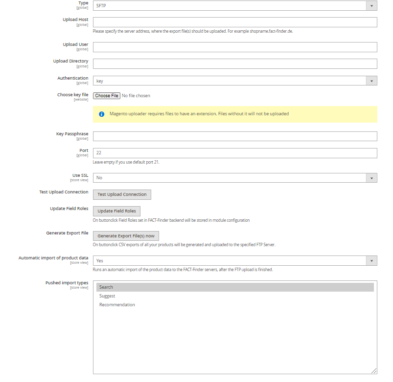

# FACT-Finder® Web Components for Magento 2

[](https://packagist.org/packages/omikron/magento2-factfinder)
[](https://github.com/FACT-Finder-Web-Components/magento2-module/actions)
[](https://github.com/FACT-Finder-Web-Components/magento2-module/graphs/contributors)

This document helps you integrate the FACT-Finder Web Components SDK into your Magento 2 Shop. In addition, it gives a
concise overview of its primary functions. The first chapter *Installation* walks you through the suggested installation
processes. The second chapter “Backend Configuration” explains the customisation options in the Magento 2 backend. The
final chapter *Web Component Integration* describes how the web components interface with the shop system and how to
customise them. 

## Table of contents
- [Requirements](#requirements)
- [Installation](#installation)
- [Activating the Module](#activating-the-module)
- [Backend Configuration](#backend-configuration)
    - [Main Settings](#main-settings)
        - [FACT-Finder version](#fact-finder-version)
        - [Server Side Rendering](#server-side-rendering)
    - [Advanced Settings](#advanced-settings)
    - [Activated Web Components](#activated-web-components)
    - [Export Settings](#export-settings)
    - [CMS Export Settings](#cms-export-settings)
    - [Data Transfer Settings](#data-transfer-settings)
        - [Updating Field Roles](#updating-field-roles)
        - [Automatic Import](#automatic-import)
- [Data Export](#data-export)
    - [Integration Methods](#integration-methods)
        - [FTP Export](#ftp-export)
        - [HTTP Export](#http-export)
    - [Console Command](#console-command)
- [Web Component Integration](#web-component-integration)
    - [Communication Element](#communication-element)
    - [Searchbox Integration and Functions](#searchbox-integration-and-functions)
    - [Process of Data Transfer between Shop and FACT-Finder](#process-of-data-transfer-between-shop-and-fact-finder)
        - [Using Proxy](#using-proxy)
    - [Using FACT-Finder on category pages](#using-fact-finder-on-category-pages)
    - [Tracking](#tracking)
- [Modification examples](#modification-examples)
    - [Changing existing column names](#changing-existing-column-names)
    - [Adding new column](#adding-new-column)
        - [GenericField usage](#genericfield-usage)
    - [Adding custom communication parameter](#adding-custom-communication-parameter)
    - [Adding custom product data provider](#adding-custom-product-data-provider)
    - [Configure field to be exported from variant](#configure-field-to-be-exported-from-variant)
- [Troubleshooting](#troubleshooting)
    - [Removing `/pub` from exported URLs](#removing-pub-from-exported-urls)
- [Contribute](#contribute)
- [License](#license)
    
## Requirements

This module supports:

- Magento 2 version 2.3 and higher
- PHP version 7.2 and higher  

## Installation

To install module, open your terminal and run the command:

    composer require omikron/magento2-factfinder

Optionally, you can specify a version constraint, e.g. `omikron/magento2-factfinder:^1.3`. Refer to Composer manual
for more information. If, for some reason, `composer` is not available globally, proceed to install it following the
instructions available on the [project website](https://getcomposer.org/doc/00-intro.md).

## Activating the Module

From the root of your Magento 2 installation, enter these commands in sequence:

    php bin/magento module:enable Omikron_Factfinder
    php bin/magento setup:upgrade

As a final step, check the module activation by running:

    php bin/magento module:status

The module should now appear in the upper list *List of enabled modules*.

Also, check in the Magento 2 backend "Stores → Configuration → Advanced → Advanced" if the module output is activated.


## Backend Configuration

Once the FACT-Finder module is activated, you can find the configurations page under "Stores → Configuration → Catalog → FACT-Finder". Here you can customise the connection to the FACT-Finder service. You can also activate and deactivate single web components, as well as access many additional settings.

### Main Settings

At the top of the configurations page are the main settings. The information with which the shop connects to and authorises itself to the FACT-Finder Service are entered here. In the first line, activate your FACT-Finder integration. Before any changes become active, save them by clicking "Save Config".
In some cases, you need to manually empty the cache (*Configuration* and *Page Cache*).
Click the button "Test Connection" to check the connection to the FACT-Finder service.

**Note:** the channel name needs to be entered correctly to establish a connection.

Here you can also enable the rendering of category pages using FACT-Finder. More details can be found [here](#using-fact-finder-on-category-pages).

At the end of the *Main Settings* section is an option *Show 'Add to Cart' Button in Search Results*. Activate this option to add a button to the products displayed on the search result page, which directly
adds that product to the shopping cart. This feature works only for simple products. For configurable products user will be redirected to product page to choose specific product variant.
Warning: The product added to the cart is identified by the variable "MasterProductNumber". To allow this function to work correctly, the field "MasterProductNumber" must be imported to the FACT-Finder backend (on fact-finder.de).   

By enabling option *Activate Logging*, all exceptions thrown during communication with FACT-Finder server will be saved in log file `var/log/factfinder.log`.

**Note:** that is a server side communication option: Web Components behaviour won't be affected.


#### FACT-Finder version
From version 2, the module supports both `7.3` and `NG`. If you use lower version, please install [NG submodule](https://github.com/FACT-Finder-Web-Components/magento2-ffng-module)

#### Server Side Rendering
That option enables Server Side Rendering (SSR) for `ff-record-list` element on category and search result pages.
That means when user navigate to a page of mentioned type, the HTML output will contain the pre-rendered custom elements.
This is useful especially in terms of SEO because `ff-record-list` renders product data which could have much impact on page rating in browser.
Without SSR enabled, web crawlers could not have a chance to scan the element rendered content because it will not yet be rendered on the time of scanning.
The module uses [Mustache.php](https://github.com/bobthecow/mustache.php) library for template processing

**Note:** More information about SSR concept you can find in the article [Server Side Rendering](https://web-components.fact-finder.de/documentation/4.x/server-side-rendering) from Web Components documentation.

### Advanced Settings

Advanced Settings contains additional parameters used for the `ff-communication` web component. Each setting is set to a
default value and has a short explanatory text attached.  
 
#### Currency and Country Settings
You don't need to set currency nor country only for module purposes. It will use currently used currency and pass this information to `ff-communication`
component as respectively `currency-code` and `country-code` parameters. You can find these settings under Magento General settings
- [How to configure currency?](https://docs.magento.com/m2/ce/user_guide/stores/currency-configuration.html)
- [How to configure country?](https://docs.magento.com/m2/ce/user_guide/stores/country-options.html)

### Export Settings


In this section users can decide if the attributes should be exported as single fields or grouped into a multi-attribute field.
Setting Multi-Attribute to No will result attribute being part of cumulative column FilterAttribute.
Setting value to Yes will result attribute will be exported into separated column.

 Attribute export is working for the attributes of type:
- boolean
- price
- select
- multiselect
- all scalars

#### Numerical attributes

Setting a multi-attribute field as numerical, will cause this field to be exported to a separate multi-attribute column named `NumericalAttributes`.
This would easier filter configuration in FACT-Finder.

**Note:** Attributes which are part of configuration are always exported to `FilterAttributes`. 

### CMS Export Settings

You can export Your CMS pages to FACT-Finder to present them in suggest results.


- **Pages Blacklist** - allow user to filter out pages, which should not be exported, for example "404 Not Found page"
  should not be visible at suggested records

If you want to start using CMS export in your project, please contact a person from FACT-Finder who is assigned to your project or ask our Service Desk.

**Note:** CMS Export is available only via console command

### Data Transfer Settings
This option configures the connection with the FACT-Finder system via FTP/SFTP. Shop data can be generated and transferred to
FACT-Finder using FTP/SFTP. FACT-Finder needs to be up to date on the product data, to ensure that components like the search work as intended.

For FTP servers you will likely specify the user and password
For SFTP servers you can use both authenication methods: key or password

**Note** Magento uploader does not allow files without extension. If your key file doesn't have any, please add one (for example .rsa)
**Note** Don't forget to specify the key passhprase if it's protected

Enter an server to which the CSV file is uploaded automatically. If you are not sure if Magento will be able to connect to your server, please use 
"Check Upload connection" option. 

The CSV file uses double quotes `"` for field enclosure and a semi-colon `;` as field delimiter.

The *Select additional Attributes* option offers a multiple-choice list of attributes. Select all of those you want added to the CSV file.

Before starting the export by clicking *Generate Export File(s) now*, you need to commit all changes by clicking "Save Config".
The exception from that rule is `Test Connection` function which always takes the actual values from the corresponding fields.



#### Updating Field Roles
Field roles are assigned while creating new channel in FACT-Finder application, however they can be changed anytime. In this situations, You need to update field roles which are being kept in Magento database for tracking purposes.
To updates field roles, use the button `Update Field Roles`

#### Automatic Import
Once the feed file is uploaded (using [FTP Export](#ftp-export)), in order FACT-Finder to start serving new data, import needs to be triggered. Module allows
You to enable automatic import which makes FACT-Finder import will be triggered, right after the feed file is uploaded onto FTP server. You can also select which of data types
should be imported automatically
- Data (Search)
- Suggest
This is a multiselect field so You can select both of them

## Data Export
In following section You'll get information how, to integrate Your feed with FACT-Finder. Feed is built the same way, regardless of chosen method, so You can choose from one of possible methods.  
### Integration Methods
#### FTP export
This method exports feed from shop system and uploads it to FTP server. In order to use this method of export, You need to have FTP server configured (described in section [Data Transfer Settings](#data-transfer-settings)).
Then You can click the button (visible below) to generate and then, upload file via FTP.
 
 now")

Using of that button is dedicated mostly for ad-hoc export. In production environment You'll rather use Cron job which will do the same work without forcing You to click the export button each time You want to send new data to FACT-Finder.
To configure Cron, please activate the option *Generate Export Files(s) automatically* and the export will be generated every day at 01:00 server time.

In file [crontab.xml](src/etc/crontab.xml) You can see a expression `<schedule>0 1 * * *</schedule>` which is a default value however You can define your own cron expression in the module configuration (section visible below).
Value set here, will override the default crontab config.
Please remember that this setting is only for that specific task ran under Magento supervisor. It won't work until You have not system Cron configured. To do that, You'll need to add Magento Cron entrypoint to Your system crontab file. 
Read this [tutorial](https://devdocs.magento.com/guides/v2.3/config-guide/cli/config-cli-subcommands-cron.html) for more information
  


#### HTTP Export

Alternative way to integrate Your feed is to use builtin FACT-Finder functionality to periodically download feed from specific URL
which the feed is accessible at. This URL should be secured by Basic Auth (username and password configured at section [Data Transfer Settings](#data-transfer-settings))
in order only authenticated users get access to. By making this URL no secured, You are allowing literally everyone to download Your feed!  

Exports are available under following location: `https://YOUR_SHOP_URL/factfinder/export/product/store/YOUR_STORE_ID`

If there's no `store id` provided, feed will be generated with the default store (by default with id = 1)

You should provide this URL in Your FACT-Finder UI


### Console Command
If You are a developer and want to test feed is generated correctly or You do not want to executing magento cron
You can use console command which is implementation of Command of Symfony Console Component, builtin in Magento2. 
Command name: `factfinder:export [TYPE]`. You can add execution of this command to Your crontab file.
- Arguments:
    - type (mandatory) - set the `FeedFactory` class with a type of data to be exported. If for a given type, no data provider exists, an exception will be thrown. Possible default values are `product` and `cms`.
- Options (all optional)
    - store - define a store, which the product data will be taken from
    - skip-ftp-upload - skips the ftp upload
    - skip-push-import - skips triggering import
    
## Web Component Integration

You can activate and deactivate any web components from the configurations page in the Magento 2 backend.

The HTML code for the web components can be found in this folder:

    src/view/frontend/templates/ff

The module styles can be found in this folder

    src/view/frontend/web/css/source/ff

Since Magento 2 is using Less, all source styles are written in this stylesheet language
 
    src/view/frontend/web/css/source/_module.less


You can integrate the templates anywhere within your shop system. The recommended way is to use Magento2 layouts for that.
As an example, the `ff-suggest` element was integrated into the `ff-searchbox` template for this SDK: 

```xml
<referenceBlock name="top.search">
    <action method="setTemplate" ifconfig="factfinder/general/is_enabled">
        <argument name="template" xsi:type="string">Omikron_Factfinder::ff/searchbox.phtml</argument>
    </action>
    <block class="Magento\Framework\View\Element\Template" name="factfinder.suggest" as="suggest" ifconfig="factfinder/general/is_enabled" template="Omikron_Factfinder::ff/suggest.phtml" />
</referenceBlock>
```

You can also instantiate block in templates using the Magento Layout API, but it's not a recommended way

```php
<?php echo $this->getLayout()
->createBlock(\Magento\Framework\View\Element\Template::class)
->setTemplate('Omikron_Factfinder::ff/suggest.phtml')
->toHtml(); ?>
```

### Communication Element
The main configuration element of Web Components `ff-communication` element is included in template `src/view/frontend/templates/ff/communication.phtml` which comes together with a dedicated view model `src/ViewModel/Communication.php`.
This template is part of the `default` layout, added to the `after.body.start` container.
It is essential for whole module to work, so make sure it is also included in your project.

**Note:** Avoid overriding both the template and view model.

### Searchbox Integration and Functions

As soon as the FACT-Finder-Integration is activated in the configuration, the search box web component is automatically activated. It replaces your standard search in Magento2 2.

You can find the template for the FACT-Finder Search at:

    src/view/frontend/templates/ff/searchbox.phtml

Once you perform a search, you will automatically be redirected to a new and improved version of the Magento 2 search result page, which works with FACT-Finder data. Additionally, FACT-Finder enriches the new search result page’s URL with relevant data, like the search’s FACT-Finder channel or the search query string. The module’s source code contains the search results’ layout definition in this XML file:

    src/view/frontend/layout/factfinder_result_index.xml

Several templates are already integrated into this layout, among others `ff-record-list`, which displays the search results.
 
### Process of Data Transfer between Shop and FACT-Finder

By default search/suggest requests are performed directly to FACT-Finder bypassing Magento backend. However if for some reason, You want to modify request parameters
or want to modify the response before returning it to the front, You can enable **Proxy**. 

#### Using Proxy
By enabling this, once a search query is sent, it does not immediately reach FACT-Finder, but is handed off to a specific controller

    src/Controller/Proxy/Call.php

which hands the request to the FACT-Finder system, receives the answer, processes it and only then returns it to the frontend/web component.
You can add a `afterExecute` plugin using Magento Interceptor mechanism to enrich data received from FACT-Finder.

**Note:**
Sending each request to FACT-Finder instance trough Magento, you lose on performance as each request need to be handled first by HTTP server and then, by Magento itself. This additional traffic could be easily avoided by not activating this feature if there's no clear reason to use it.

### Using FACT-Finder on category pages
Module in order to preserve categories URLs and hence SEO get use of standard Magento routing with the combination of FACT-Finder availability to pass custom parameters to search request.
Once user is landed on category page. Search request is performed immediately (thanks to `search-immediate` communication parameter usage).
To enable that, turn on corresponding option in *Main Settings* section.
 
### Tracking
The module uses Web Components API to track following events:
- click on product
- add product to cart
- purchase an order
- user login

To track product click make sure your record template uses `data-redirect` directive described in [Tracking guide](https://web-components.fact-finder.de/documentation/4.x/tracking-guide).
Adding to cart is tracked using WEB Components API in `src/view/frontend/web/js/catalog-add-to-cart-mixin.js:28` script.
To make it work, make sure that you are using base `catalog-add-to-cart.js`, otherwise the mixing will not be applied. 
Checkout tracking is done using the `ff-checkout-tracking` element.
This element is added in `src/view/frontend/templates/ff/checkout-tracking.phtml` which extend the `checkout_onepage_success` layout.
If you do not use this layout in your checkout make sure you append it to your own one. For that you can use the view model `src/ViewModel/Order.php` which provides all necessary data from the backend to the template.
Login tracking is by additional `CustomerData` section `ffcommunication`.
This section should is configured in `src/etc/frontend/sections.xml` and should react to the user login action and reload containing data after that.

 
## Modification examples
Our Magento 2 module offers a fully working integration out of the box. However, most projects may require
modifications in order to fit their needs. Here are some common customization examples.

### Changing existing column names
The module has predefined column names defined in the main DI configuration `etc/di.xml`. These follow our feed best
practices. The default DataProvider is configured to export data for columns with same names, so in order to change column
name, you will need to add two modifications:

* Define new column name in your custom module `di.xml`. The following code snippet shows how to change name for column
Master Product Number (in module named `Master`):

```xml
<virtualType name="Omikron\Factfinder\Model\Export\CatalogFeed">
    <arguments>
        <argument name="columns" xsi:type="array">
            <item name="Master" xsi:type="string">CUSTOM_NAME</item>
        </argument>
    </arguments>
</virtualType>
```

* Once the column name is changed in `di.xml`, add a plugin to the DataProvider and replace the standard name with new one.
Remember that you do not need to copy rest of elements. They won't be removed because the DI configuration loading mechanism
will merge all definitions into one output. Example implementation:

```xml
<type name="Omikron\Factfinder\Model\Export\Catalog\ProductType\SimpleDataProvider">
    <plugin name="custom-provider" type="YOUR_VENDOR\YOUR_MODULE\Plugin\AfterToArrayPlugin" />
</type>
```

```php
public function afterToArray($subject, $result)
{
    return ['CUSTOM_NAME' => $result['Master']] + $result;
}
```

Finally, run `bin/magento cache:clean config` to replace old DI configuration with the one you just created.

### Adding new column
The standard feed contains all data FACT-Finder® requires to work. However, you may want to export additional information
which is relevant for your project and not part of a default Magento 2 installation.  In order to do so, let's take a look
into the DataProvider definition:
 
 ```xml
<type name="Omikron\Factfinder\Model\Export\Catalog\FieldProvider">
     <arguments>
         <argument name="productFields" xsi:type="array">
             <item name="ImageURL" xsi:type="object">Omikron\Factfinder\Model\Export\Catalog\ProductField\ProductImage</item>
             <item name="CategoryPath" xsi:type="object">Omikron\Factfinder\Model\Export\Catalog\ProductField\CategoryPath</item>
             <item name="Attributes" xsi:type="object">Omikron\Factfinder\Model\Export\Catalog\ProductField\Attributes</item>
         </argument>
     </arguments>
 </type>
 ```

The constructor argument `productFields` stores references to specific fields that require more logic than simply retrieving
data from the product. Let's assume we want to add a new column `BrandLogo` containing image URLs. In your module DI, add
the new field definition:
 
```xml
<type name="Omikron\Factfinder\Model\Export\Catalog\ProductType\SimpleDataProvider">
    <arguments>
        <argument name="productFields" xsi:type="array">
            <item name="BrandLogo" xsi:type="object">YOUR_VENDOR\YOUR_MODULE\Model\Export\Catalog\ProductField\BrandLogo</item>
        </argument>
    </arguments>
</type>
```

Again, there is no need to copy all other field definitions: Magento will merge the existing ones with the one you just created.
In order for your field exporter to work, it has to implement `Omikron\Factfinder\Api\Export\FieldInterface`.
Your class skeleton to export the brand logo could look like this:
 
```php
class BrandLogo implements \Omikron\Factfinder\Api\Export\FieldInterface
{
    public function getValue(Product $product): string
    {
        // Getting products brand logo URL...
    }
}
```

Finally, You need to define new column in CatalogFeed definition in di.xml`.

```xml
<virtualType name="Omikron\Factfinder\Model\Export\CatalogFeed">
    <arguments>
        <argument name="columns" xsi:type="array">
            <item name="BrandLogo" xsi:type="string">BrandLogo</item>
        </argument>
    </arguments>
</virtualType>
```

#### GenericField usage
If extracting logic is just a retrieving attribute value from product without any further data transformation creating virtual type of *GenericField* might be used instead of implementing *FieldInterface*.
The constructor for this class requires only an attribute code to be exported.
```xml
<virtualType name="Omikron\Factfinder\Model\Export\Catalog\ProductField\Brand" type="Omikron\Factfinder\Model\Export\Catalog\ProductField\GenericField">
    <arguments>
        <argument name="attributeCode" xsi:type="string">manufacturer</argument>
    </arguments>
</virtualType>
``` 

Now run `bin/magento cache:clean config` to use the new DI configuration.

### Adding custom communication parameter
Module configuration allows You to pass constant values to each params, however sometimes You may need to provide variable value i.e. depending on currently logged customer. In order to do that, You should create
custom Parameter Provider.

```php
class CustomAddParams implements \Omikron\Factfinder\Api\Config\ParametersSourceInterface
{
       public function getParameters(): array
       {
           return [
               'add-params'  => $this->getMyVariableParameters(),
           ];
       }
}
```

All registered Parameters Providers are executed in loop its results are stored in associative array which in result will be passed to the frontend.

Please keep in mind, that on this level of execution, parameters will be overridden each time, Parameter Provider returns a value with a key
which already exist in the result array. By using Magento dependency injection mechanism Your Parameter Providers added from project level will be evaluated last, but If You
want to add more than one, You need to maintain their order. In following example, if parameter arrays provided by CustomProviderFirst and CustomProviderSecond have an intersection, for given key, the value
from CustomProviderSecond will be returned in a result
   
```xml
    <type name="Omikron\Factfinder\Model\Config\CommunicationParametersProvider">
        <arguments>
            <argument name="parametersSource" xsi:type="array">
                <item name="first" xsi:type="object">YOUR_VENDOR\YOUR_MODULE\Model\Config\CustomProviderFirst</item>
                <item name="second" xsi:type="object">YOUR_VENDOR\YOUR_MODULE\Model\Config\CustomProviderSecond</item>
            </argument>
        </arguments>
    </type>
 ```

### Adding custom product data provider
If You are in need to define new product types, and its data cannot be provided by any of existing Data Providers, You should create
a custom Data Provider and map it to Your product type. This operation like previous are available via Magento DI mechanism. In your module DI add following
xml code

```xml
    <type name="Omikron\Factfinder\Model\Export\Catalog\DataProvider">
        <arguments>
            <argument name="entityTypes" xsi:type="array">
                <item name="customProductType" xsi:type="string">YOUR_VENDOR\YOUR_MODULE\Model\Export\Catalog\ProductType\CustomDataProvider</item>
            </argument>
        </arguments>
    </type>
```

```php
<?php
class CustomDataProvider implements DataProviderInterface
{
    /** @var Product */
    protected $product;

    public function __construct(Product $product)
    {
        $this->product = $product;
    }

    /**
     * @inheritdoc
     */
    public function getEntities(): iterable
    {
        // Your logic
    }
}
```

It's a minimum configuration. `$product` constructor will be passed automatically and in method `getEntities` You should extract all required data

### Configure field to be exported from variant
By default, module exports data from configurable product. Its variants override only few of fields which you can see in class:

    src/Model/Export/Catalog/Entity/ProductVariation.php

This is done to provide the best performance but if you variants differs in some attributes other than configurable attributes (color, size etc.) You can configure which fields should be exported from variants.
Use `variantFields` argument for that. 
Here is the example from module, where we want to export `ImageURL` from variants because some configurable attribute could have an impact on the how product looks (color is a good example).
```xml
<type name="Omikron\Factfinder\Model\Export\Catalog\FieldProvider">
    <arguments>
        <argument name="productFields" xsi:type="array">
            <item name="CategoryPath" xsi:type="object">Omikron\Factfinder\Model\Export\Catalog\ProductField\CategoryPath</item>
            <item name="Brand" xsi:type="object">Omikron\Factfinder\Model\Export\Catalog\ProductField\Brand</item>
            <item name="FilterAttributes" xsi:type="object">Omikron\Factfinder\Model\Export\Catalog\ProductField\FilterAttributes</item>
        </argument>
        <argument name="variantFields" xsi:type="array">
            <item name="ImageURL" xsi:type="object">Omikron\Factfinder\Model\Export\Catalog\ProductField\ProductImage</item>
        </argument>
    </arguments>
</type>
```

## Troubleshooting

### Removing `/pub` from exported URLs
If the exported feed file contains URLs with `pub/` added, most probably your document root is set to the `/pub` folder. In order to skip this part in URL, please add following entry to your project's `env.php` file:
```php
'directories' => [
    'document_root_is_pub' => true
],
``` 

## Contribute
For more information, click [here](.github/CONTRIBUTING.md)

You can also open a new issue if You spot a bug or just have an idea for module improvement
To check currently opened issues [here](https://github.com/FACT-Finder-Web-Components/magento2-module/issues).

## License
FACT-Finder® Web Components License. For more information see the [LICENSE](LICENSE) file.
